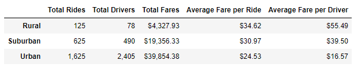
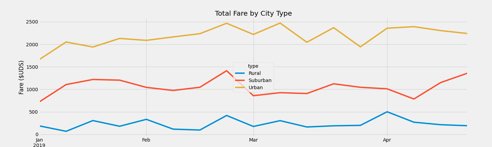

# PyBer Ride Share Analysis

## Overview of Analysis
Data was made available for analysis on Pyber, a ride sharing company. The results were submitted to PyBer management showing how the data differs by the city type and how these differences can be utilized by the decision makers at PyBer.

### Background
Two data sets, City Data and Ride Data which included city names, city types (Urban, Suburban, Rural), dates of ride, fare, rider id and driver counts per city. The two datasets were merged, and a summary was created on the ride share information retrieved.

### Objectives
- Create a summary table of ride sharing data by city type.
- Create a multiline chart to display the total fares by city type.

### Deliverables
1. Provide the total number of rides, by city type.
2. Extract the total number of drivers operating within each of the city types.
3. Summarize the total fares collected in each city type.
4. Calculate the average cost of a ride per city type.
5. Calculate the average fare collected by drivers for each city type.
6. Resample the data set to provide weekly totals for the fares form January 1, 2019 through April 29, 2019.

### Methods

#### Resources
Two data sources, software and GitHub was used in the analysis of the PyBer data.
- Data Sources: Two data sources, one containing city data and the other with rider data were provided by PyBer.
    - city_data.csv [City_Data](Resources/city_data.csv)
    - ride_data.csv [Rider_Data](Resources/ride_data.csv)
- Software:
    - Microsoft Excel was used to open and inspect the CSV files.
    - Visual Studios Code was used to display the instructions and collect notes.
    - Jupyter Notebook with Pandas, Matplotlib and Python was used to create, compile and run the code in the analysis.
- GitHub: GitHub was used as the repository to store, update and share the code with the project group.

#### Procedures
1. Create a single DatFrame for analysis.
    - Load city_data.csv file into a Pandas DataFrame.
    - Load ride_data.csv file into a Pandas DataFrame.
    - Merge the two DataFrames into one using **pandas.DataFrame.merge()**.
2. Create a summary DatFrame by city type.
    - Total Rides: The merged dataset was used to groupby the city type to calculate the count of rides.
    - Total Drivers: The city dataset was used to calculate the total drivers within a city by use of groupby city type for the sum of drivers. *NOTE - could not use the merged dataset to make this calculation as the merged dataset included multiple instances of driver count creating and incorrect summation of the total drivers*.
    - Total Fares: The total fares were extracted by grouping the dataset by city type and summing the fares.
    - Average Fares per Ride: This metric was calculated by dividing the result of Total Fares by the result of Total Rides.
    - Average Fares per Driver: The average driver fare was calculated by dividing the Total Fares by Total Drivers.
    - Using the results of the calculated metrics, a pandas Dataframe was created with the city type as the index and the individual metrics as the data columns.
    - Remove index name from displaying in the DataFrame.
    - Formatted the data using **.map()**.

    

3. Create a multiple line plot to show the weekly total of the fares by each city type for the time range 2019.01.01 to 2019.04.29.
    - Group the merged dataset by city type and date to sum the fares.
    - Reset the index using **.reset_index()**.
    - Create a pivot table with date as the index, city type as the columns and fare as the values.
    - Filter the DataFrame using **.loc[]** to extract the data for the given time range.
    - Convert the date to datetime data type using **.to_datetime()**.
    - Resample the dataset to get the sum of fares by week using the **.reasmple()**.
    - Plot the resampled dataset using **df.plot()**.
    - Save a copy of the plot as a PNG.

    

## Results
The analysis results are listed below.

### Total Rides by City Type
The summary of total rides indicates that there were 125, 625 and 1625 riders in the Rural, Suburban and Urban city types respectively.  The summary suggests a relationship between the city type where the ridership is directly propotional to the size of the population.

### Total Drivers by City Type
The Total Driver summary shows that the rural city type has a total of 78 drivers followed by suburban with 490 drivers and urban with 2405 drivers. The drivers by city type have a similar relationship as the total rides where the Total Drivers by City is directly proportional to the population of the city type.

### Total Fares by City Type
The Total Fares by City Type also follows the same pattern whereas the population increases, the revenue follows suite. Again, it is expected that as the population size grows so would the ridership and therefore a higher revenue.

### Average Fares per Ride by City Type
The average fares for Rural = $34.62, for Suburban = $30.97 and for Urban = $24.53. In contrast to the total rides, total drivers and total fares, the average fares per ride by city type shows a negative correlation whereas the population increases the fare is reduced. The result seems to follow the supply and demand relationships where when there is a low supply of the goods the value of the goods is increased. The higher average fare seen for the rural cities also can be an indication that the rural rides are longer in distance and duration in comparison to the suburban and urban rides.

### Average Fares per Driver by City Type
The average fares per drives also follows the trend set by average fares per rides with a decrease in the average fare as the population increases with Rural = $55.49, Suburban = $39.50 and Urban = $16.57. As with the average fares per ride, the average fared per driver also can be attributed the distance travelled by the rural riders.

### Weekly Trends of Fares by City Type
Weekly fares trend shows that through the date range of 2019.01.01 to 2019.04.29 the rural fares were between $67.65 and $501.24, suburban fares fell between $721.60 and $1412.74 and the urban fares were between $1661.68 and $2470.93.

All three of the weekly fares trends showed a peak at the end of February with a general increase in the fares up to that point. In March the rural and suburban fares stayed flat while the urban fares decreased. For April, the rural and urban fares decreased slightly while the suburban fares increased.

## Summary
In summary, the analysis shows that the results for total rides, total drivers and total fares follow the city types according to the population size. The larger the population the higher the ridership, the number of drivers and therefore the revenue. The results for the average fares by rides and average fares by drivers also has correlation to the populations size. But in contrast to the totals, the averages are inversely proportional to the population size where higher the population lower the fares.

Affordability: The affordability of the fares is an issue to be considered. It will be helpful to understand the causes that affect the fare, especially in the rural cities. Discounts and rate adjustments can be considered for the riders to make the rides more affordable.

Availability: There maybe concessions that can be awarded to the drivers as incentives to serve the rural communities. This in turn will increase the driver pool in the rural cities. The factors such as driver locality may account for the reduces availability of the drivers.

Other Factors: The dataset that was anlayzed does not address the duration or the distance of the rides. It may be prudent to have further analysis done with account to the duration and distance to further understand the relationships between fares, rides and drivers.